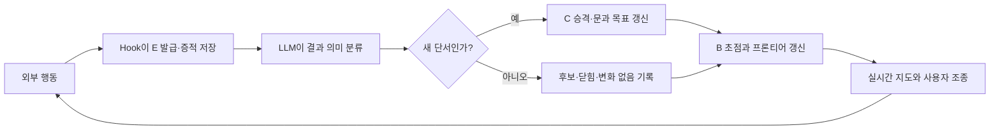

# 재사용형 Red Team Harness

[](https://github.com/moovingGun/redteam-harness/actions/workflows/ci.yml)
[](LICENSE)


> [!WARNING]
> **승인된 격리 모의침투 환경에서만 사용한다.**
> 이 저장소는 공격 행위를 수행하는 AI 에이전트를 구동하는 하네스다. 서면 승인 없이 타인의
> 시스템에 사용하는 것은 위법이다. 실제 대상·허용 범위·안전 조건은 매 실행 시작 시 별도로
> 명시해야 한다. 저장소 자체에는 특정 대상의 해답이나 익스플로잇을 포함하지 않는다.

**English summary** — A reusable, evidence-driven red-team harness for Claude Code. You start with a
single approved IP. Every tool action is recorded as an event (`E-*`), promoted into clues (`C-*`)
and user-addressable branches (`B-*`), and rendered on a live dashboard. When the agent finds a new
host that leads to the next boundary, it must submit it for approval with evidence — actions against
unapproved IPs are denied by the hook — and approving it in the dashboard opens the next stage while
keeping one continuous record. The goal is not to teach the agent a fixed attack path, but to let a
human observe and steer its autonomous exploration by pointing at branch IDs rather than dictating
techniques. macOS only, stdlib only, authorized lab use only. Full documentation below is in Korean.

하나의 IP로 시작한다. Stage는 미리 정하지 않고, 새 대상을 **사용자가 승인하는 순간** 다음 Stage가 열린다. 승인되지 않은 IP로 향하는 행동은 훅이 차단한다. MAP·E/C/B 번호·증적은 Stage가 바뀌어도 하나의 큰 문제로 계속 이어 쓴다.

## 만든 의도

이 하네스의 목적은 AI의 침투 경로를 미리 정답처럼 가르치는 것이 아니라, **AI가 평소처럼 자율적으로 탐색하는 과정을 사람이 실시간으로 관찰하고 구조적으로 조종할 수 있게 하는 것**이다.

- AI가 무엇을 실행했고 어떤 결과를 봤는지 모든 행동을 시간순 증적으로 남긴다.
- 현재 집중 경로와 아직 열려 있는 대안을 지도에 함께 표시해, 사용자가 자연어로 공격 방법을 지시하지 않고도 가지 주소만 가리켜 방향을 바꿀 수 있게 한다.
- 이전 풀이·특정 대상의 제품·경로·계정·취약점 같은 정답성 단서는 공용 지침에서 배제한다. 확정 판단은 반드시 이번 실행의 증적을 가리켜야 한다.
- 진전이 없거나 반복되는 행동도 자동으로 중단시키지 않는다. 현재 증거가 부족한 상황에서는 그 경로가 여전히 가장 유력할 수 있으므로, 활동량과 정체 상태만 보여주고 계속할지는 AI와 사용자가 판단한다.
- 한 서비스의 관리자나 데이터베이스 최고권한 같은 **국소 최고점**을 전체 문제의 종료로 오인하지 않도록, 증거가 있는 미검증 전이가 남아 있는지 다시 확인한다.

즉, 이 시스템은 AI를 제한하는 공격 체크리스트가 아니라 **자율 탐색 위에 관찰·증적·사용자 조종 계층을 덧붙인 하네스**다.

## 들어간 방법론

### 1. 증적 기반 상태 모델: E → C → B

- `E-*`(Event): 명령, 도구 호출, 성공, 실패, 타임아웃 등 모든 실제 행동이다. Hook이 실행 직전에 ID를 발급하고 종료 직후 원시 결과를 보존한다.
- `C-*`(Clue): E 결과를 AI가 해석해 승격한 단서다. 확인된 사실은 `#`, 아직 추론인 후보는 `?`로 구분하고 항상 근거 E를 연결한다.
- `B-*`(Branch): 증거나 공격 단계가 아니라 사용자가 화면에서 가리킬 수 있는 탐색 가지 주소다. `FOCUS`, `OPEN`, `PARKED`, `CLOSED` 상태로 현재 초점과 대안을 표현한다.



### 2. LLM 휴리스틱 기반 Best-first 탐색

일반적인 Best-first Search는 사람이 설계한 평가 함수 `h(n)` 또는 점수로 다음 노드를 정한다. 이 하네스에는 고정 점수표가 없다. LLM이 **이번 실행에서 수집한 증거의 강도, 더 깊은 영향으로 이어지는 문, 도달 가능성, 예상 비용과 안전 범위**를 함께 보고 현재 가장 유망한 가지를 판단한다.

따라서 정확히 말하면 **Best-first 성향을 기본값으로 둔 자율 휴리스틱 탐색**이다.

- 유망한 가지를 우선 깊게 확인하지만 Best-first를 강제하지 않는다.
- 상황에 따라 DFS식 심화, BFS식 표면 확장, 재시도, 우회 탐색을 자유롭게 사용할 수 있다.
- 고정된 점수나 행동 횟수로 가지를 자동 가지치기하지 않는다.
- 오래 걸림·반복 실패·최근 단서 없음은 화면에 표시되는 텔레메트리일 뿐 자동 후퇴 조건이 아니다.
- 사용자는 `B-*`를 지정해 AI의 공격 기법을 대신 결정하지 않고 작업 초점만 변경할 수 있다.

### 3. 동적 프론티어와 Door 기반 목표 갱신

침투 단계를 미리 번호로 고정하지 않는다. 현재 단서가 더 높은 영향이나 다음 보안 경계로 이어지는 전이를 드러내면 이를 `door`로 기록하고 현재 목표와 프론티어를 즉시 갱신한다. 직접 확인된 문은 `#`, 증거에서 추론된 문은 `?`로 유지한다. `?`도 탐색할 수 있지만 확인된 사실처럼 표현하지 않는다.

### 4. 국소 최고점과 종료 조건 분리

강한 권한을 얻었다는 이유만으로 종료하지 않는다. 현재 실행에서 관찰된 자격자료, 신뢰 관계, 인접 서비스, 추가 제어 영역처럼 더 깊은 경계로 이어질 근거가 있으면 OPEN 가지로 유지한다. 종료 후보는 명시된 목표·범위 상한·Flag·사용자가 승인한 크라운 주얼에 도달했을 때다.

### 5. Hook 기반 원자적 실시간 동기화

Claude가 나중에 MAP을 몰아서 작성하지 못하도록 외부 행동 단위로 동기화한다.

1. `PreToolUse`가 E를 발급하고 MAP에 실행 중 상태를 표시한다.
2. `PostToolUse` 또는 실패 Hook이 결과와 원시 증적을 저장한다.
3. 다음 외부 행동 전에 LLM이 결과를 `no-change`, `candidate`, `closed`, `clue` 중 하나로 분류한다.
4. 코드가 MAP·LEDGER·상태 파일을 원자적으로 다시 만든다.

분류가 끝나지 않았으면 다음 외부 행동만 잠시 막는다. 이는 탐색 방향을 제한하기 위한 것이 아니라 **행동과 지도 사이의 기록 누락을 막기 위한 동기화 장치**다.

### 6. 클린룸 독립성

공용 코드와 프롬프트에는 대상별 해답이나 이전 실행 증적을 넣지 않는다. 실행 기록은 Git에서 제외되며, 판단 근거는 현재 실행의 E-ID에 연결한다. 이를 통해 같은 환경을 다시 시험할 때 방법론은 유지하되 특정 대상의 정답을 미리 알고 푸는 효과를 줄인다.

## 실행 요구사항

**macOS 전용이다.** 다음 세 가지가 필요하다.

| 요구사항 | 비고 |
|---|---|
| macOS | 실행기가 zsh `.command` 스크립트이며 zsh 전용 파라미터 확장(`${0:A:h}`)을 쓴다. |
| `/usr/bin/python3` | 시스템 파이썬 경로를 하드코딩한다. Homebrew·pyenv 파이썬은 사용하지 않는다. Python 3.9 이상. |
| `claude` CLI | Claude Code가 설치되어 PATH에 있어야 한다. |

런타임 의존성은 표준 라이브러리뿐이므로 `pip install`은 필요 없다.

Linux·Windows에서는 그대로 동작하지 않는다. 옮기려면 각 `start-redteam.command`의 zsh 확장과
`/usr/bin/python3` 경로를 해당 환경에 맞게 바꿔야 한다.

## 사용법

1. 저장소 루트의 `start-redteam.command`를 실행한다.
2. 열린 Claude에 **시작 IP 하나**와 허용 범위, 최종 목표를 말한다.
3. 실시간 지도(`http://127.0.0.1:8765`)가 자동으로 열린다.

실행할 때마다 `runs/<run_id>/engagement/`가 새로 만들어지고 그 실행의 모든 기록이
거기에만 쌓인다. 실행 ID와 구성 이름은 시작 시 실행 창에 출력된다.

```bash
./start-redteam.command                              # 실행 ID 자동 생성, 구성 이름 default
REDTEAM_CONFIG_LABEL="프롬프트-A" ./start-redteam.command   # 비교할 구성에 이름을 붙인다
REDTEAM_RUN_ID="2026-08-26-1차" ./start-redteam.command     # 실행 폴더 이름을 직접 정한다
```

| 환경변수 | 기본값 | 뜻 |
|---|---|---|
| `REDTEAM_RUN_ID` | 시각 + 난수 | 실행 폴더 이름이자 실행 식별자. `/`와 `..`는 쓸 수 없다. |
| `REDTEAM_CONFIG_LABEL` | `default` | 비교 단위. 같은 라벨을 붙인 실행들이 한 그룹으로 묶인다. |
| `REDTEAM_PORT` | `8765` | 실시간 지도 포트. |
| `REDTEAM_SCOPE_ENFORCE` | `1` | `0`이면 범위 차단을 끈다. |

Stage를 미리 고르지 않는다. 하나의 IP로 시작하고, 탐색 중 다음 경계로 이어지는 새 IP가 나오면 승인하는 시점에 다음 Stage가 열린다.

Claude가 종료되면 뷰어도 함께 종료된다. 포트가 이미 사용 중이면 다음 빈 포트로 자동 이동하며, 실제 주소는 실행 창에 출력된다.

### 새 대상이 나왔을 때

```
Claude가 근거와 함께 승인 요청 → 대시보드 "대상 범위 승인" 카드에 버튼 →
[승인] 누르면 다음 Stage 라벨과 FOCUS 가지가 생기고 차단 해제
```

- **승인 전까지 그 IP로 향하는 외부 행동은 훅이 거부한다.** 승인 범위 밖 행위를 막는 안전장치다.
- 승인해도 이전 Stage의 가지는 CLOSED가 되지 않는다. 새 대상이 막히면 되돌아갈 수 있다.
- E/C/B 번호와 MAP·LEDGER는 Stage가 바뀌어도 끊기지 않고 이어진다.
- 거부한 대상은 이후에도 계속 차단된다.
- 검사 대상은 IP다. 점 4개 표기, IPv6 리터럴, URL에 정수·16진수로 적힌 표기까지 해석한다.
- 승인 값이 CIDR이면 대역 전체가 허용된다 (`192.0.2.0/24`). 단일 IP면 그 주소만 허용된다.
- 도메인·호스트명은 막지 않는다. CVE 조사 같은 웹 검색은 그대로 된다.
- 오탐으로 막히면 `REDTEAM_SCOPE_ENFORCE=0`으로 실행해 강제를 끌 수 있다.

> **이 차단의 위협 모델.** 정직한 AI가 실수로 승인 범위를 벗어나는 것을 막는
> 가드레일이지, 우회하려고 작정한 실행자를 막는 샌드박스가 아니다. 명령 문자열만
> 보고 판단하므로 셸 변수(`curl http://$T/`), 파일 경유(`$(cat ip.txt)`), 옥텟 루프
> (`203.0.113.$i`), 호스트명은 통과한다. 범위 통제의 최종 책임은 프롬프트 §0의 안전
> 규칙과 사용자 승인에 있고, 이 훅은 그 위에 얹는 두 번째 방어선이다.

터미널에서 직접 다룰 수도 있다.

```bash
python3 common/mapctl.py target-list
python3 common/mapctl.py target-approve --id T-02
python3 common/mapctl.py target-reject  --id T-03 --reason "범위 밖"
```

### Stage가 바뀌면 생기는 것

승인 한 번으로 아래가 한꺼번에 처리된다.

| | |
|---|---|
| Stage 라벨 | 다음 번호가 자동 배정된다 (`stage2`, `stage3`…) |
| FOCUS 가지 | 새 대상용 `B-*`가 생기고 이전 FOCUS는 OPEN으로 내려간다 |
| 작업 폴더 | `work/stageN/`이 만들어진다 (실행 폴더 안) |
| 차단 해제 | 그 IP로의 행동이 허용된다 |
| 기록 | E/C/B 번호와 MAP·LEDGER는 끊기지 않고 이어진다 |

## 구성별 비교

프롬프트나 설정을 바꿔가며 여러 번 돌린 뒤, 어느 구성이 실제로 무엇이 달랐는지 같은 축에서 본다.
실행마다 기록이 격리되어 있으므로 사후에 실행 경계를 추측할 필요가 없다.

```bash
REDTEAM_CONFIG_LABEL=baseline ./start-redteam.command
REDTEAM_CONFIG_LABEL=baseline ./start-redteam.command
REDTEAM_CONFIG_LABEL=tuned    ./start-redteam.command

python3 common/runstat.py            # 구성별 비교표
python3 common/runstat.py --per-run  # 실행별 상세까지
python3 common/runstat.py --json     # 그대로 가공할 때
```

```
config    runs  empty  actions    clues  stages  ok%   io           duration
--------  ----  -----  ---------  -----  ------  ----  -----------  --------
baseline  2     0      1.5 (1.5)  0.0    1       67%   1.2K (1.2K)  21.4s
tuned     2     1      0.5 (0.5)  0.5    1       100%  2.5K (2.5K)  0.1s
```

`EVENTS.jsonl`의 모든 줄이 아래 네 값을 함께 들고 있어서, 줄 하나만 봐도 어느 실행의 것인지 알 수 있다.

| 필드 | 뜻 |
|---|---|
| `run_id` | 실행 식별자. `runs/<run_id>/` 폴더 이름과 같다. |
| `config_label` | 비교 그룹 이름. `runstat`이 이 값으로 묶는다. |
| `harness_rev` | 그 실행에 쓰인 하네스 코드의 git 리비전. 워킹트리가 수정된 상태였으면 `-dirty`가 붙는다. |
| `io_bytes` | 그 줄이 옮긴 바이트 수. `phase:"start"`는 도구로 들어간 입력, `phase:"finish"`는 도구가 돌려준 응답, `phase:"classification"`은 외부 I/O가 없으므로 0. |

읽을 때 주의할 것.

- `empty` 열은 행동을 하나도 남기지 못한 실행 수다. 이 실행들도 평균에 0으로 들어간다. 집계에서 빼면 비교가 성공한 실행 쪽으로 치우치므로 빼지 않고, 대신 몇 건인지 따로 보여준다.
- `ok%`는 실행별 성공률의 평균이 아니라 그룹의 전체 시도를 모아 계산한 비율이다. 행동 수가 제각각인 실행을 같은 무게로 평균 내면 짧은 실행이 과대 대표된다.
- 한 구성 안에서 `harness_rev`가 섞이면 경고를 출력한다. 그 행의 차이는 구성 차이인지 코드 차이인지 구분할 수 없다.
- 이것은 **활동량 지표이지 성과 지표가 아니다.** 행동이 많거나 I/O가 크다고 더 나은 탐색은 아니다. 무엇이 더 나았는지는 여전히 사람이 증적을 보고 판단한다.

## 폴더 역할

- `start-redteam.command`: 유일한 실행기. 문제 하나를 처음부터 끝까지 이것으로 진행한다.
- `common/`: 재사용 코드, Hook 설정, 중립 프롬프트, 뷰어, 집계기. 특정 대상의 답·단서·증적을 넣지 않는다.
- `runs/<run_id>/`: 실행 하나가 통째로 들어가는 폴더. Git에서 제외된다.
- `tests/`: 승인 흐름과 범위 차단 검증.

실행 폴더 안은 이렇게 나뉜다.

```
runs/<run_id>/
├── RUN.json          실행 ID·구성 이름·하네스 리비전·시작 시각
├── settings.json     이 실행에 쓰인 훅 배선 (절대 경로로 굳혀 생성)
└── engagement/       CLAUDE_PROJECT_DIR. 여기서 claude가 뜬다
    ├── MAP.md, LEDGER.md, EVENTS.jsonl, DECISIONS.jsonl
    ├── runtime/, evidence/     하네스가 소유한다. 직접 편집하지 않는다
    └── work/stageN/            Stage 승인 시 생기는 작업 폴더
```

기록 파일과 작업 파일이 섞이지 않도록 자리를 나눴다. 하네스가 만드는 것은 `engagement/` 바로 아래, 사람과 AI가 만드는 것은 `engagement/work/stageN/` 아래다.

Stage가 바뀌어도 전체 문제 기록은 그 실행의 `engagement/`에서 계속 누적된다. 반대로 **실행이 바뀌면 기록은 이어지지 않는다.** 한 폴더에 계속 이어 쓰면 어느 이벤트가 어느 실행 것인지 사후에 갈라낼 수 없고, 앞선 실행의 MAP·STATE가 다음 실행의 출발점을 오염시킨다. 공용 폴더에는 방법론과 작동 코드만 둔다.

> 훅 배선을 실행마다 다시 생성하는 이유. `common/settings.json`은 훅 경로를 `__HARNESS_COMMON__`
> 자리표시자로 들고 있는 템플릿이고, 실행 시작 시 절대 경로로 펼쳐져 `runs/<run_id>/settings.json`이
> 된다. 예전처럼 `${CLAUDE_PROJECT_DIR}/../common` 같은 깊이 의존 경로를 쓰면 실행 폴더가 한 단계
> 깊어지는 순간 모든 훅이 조용히 로드 실패한다. 실제로 그 회귀가 한 번 났고, 훅이 하나도 뜨지 않은
> 채로 테스트는 전부 통과했다.

## 라이선스

MIT. [LICENSE](LICENSE) 참고.
