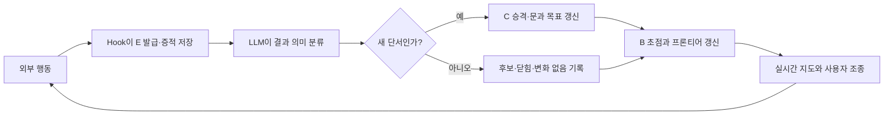

# 재사용형 Red Team Harness

> [!WARNING]
> **승인된 격리 모의침투 환경에서만 사용한다.**
> 이 저장소는 공격 행위를 수행하는 AI 에이전트를 구동하는 하네스다. 서면 승인 없이 타인의
> 시스템에 사용하는 것은 위법이다. 실제 대상·허용 범위·안전 조건은 매 실행 시작 시 별도로
> 명시해야 한다. 저장소 자체에는 특정 대상의 해답이나 익스플로잇을 포함하지 않는다.

**English summary** — A reusable, evidence-driven red-team harness for Claude Code. Every tool
action is recorded as an event (`E-*`), promoted into clues (`C-*`) and user-addressable branches
(`B-*`), and rendered on a live per-stage dashboard. The goal is not to teach the agent a fixed
attack path, but to let a human observe and steer its autonomous exploration by pointing at branch
IDs rather than dictating techniques. macOS only, stdlib only, authorized lab use only. Full
documentation below is in Korean.

`common/`의 코드와 일반 지침 하나를 공유한다. Stage 1–3은 하나의 큰 문제로 보고 MAP·E/C/B 번호·증적을 계속 이어 쓰며, 각 Stage의 작업 파일만 하위 폴더로 나눈다.

## 만든 의도

이 하네스의 목적은 AI의 침투 경로를 미리 정답처럼 가르치는 것이 아니라, **AI가 평소처럼 자율적으로 탐색하는 과정을 사람이 실시간으로 관찰하고 구조적으로 조종할 수 있게 하는 것**이다.

- AI가 무엇을 실행했고 어떤 결과를 봤는지 모든 행동을 시간순 증적으로 남긴다.
- 현재 집중 경로와 아직 열려 있는 대안을 지도에 함께 표시해, 사용자가 자연어로 공격 방법을 지시하지 않고도 가지 주소만 가리켜 방향을 바꿀 수 있게 한다.
- 이전 풀이·특정 대상의 제품·경로·계정·취약점 같은 정답성 단서는 공용 지침에서 배제한다. 확정 판단은 반드시 이번 실행의 증적을 가리켜야 한다.
- 진전이 없거나 반복되는 행동도 자동으로 중단시키지 않는다. 현재 증거가 부족한 상황에서는 그 경로가 여전히 가장 유력할 수 있으므로, 활동량과 정체 상태만 보여주고 계속할지는 AI와 사용자가 판단한다.
- 한 서비스의 관리자나 데이터베이스 최고권한 같은 **국소 최고점**을 전체 문제의 종료로 오인하지 않도록, 증거가 있는 미검증 전이가 남아 있는지 다시 확인한다.

즉, 이 시스템은 AI를 제한하는 공격 체크리스트가 아니라 **자율 탐색 위에 관찰·증적·사용자 조종 계층을 덧붙인 하네스**다.

## 들어간 방법론

### 1. 증적 기반 상태 모델: E → C → B

- `E-*`(Event): 명령, 도구 호출, 성공, 실패, 타임아웃 등 모든 실제 행동이다. Hook이 실행 직전에 ID를 발급하고 종료 직후 원시 결과를 보존한다.
- `C-*`(Clue): E 결과를 AI가 해석해 승격한 단서다. 확인된 사실은 `#`, 아직 추론인 후보는 `?`로 구분하고 항상 근거 E를 연결한다.
- `B-*`(Branch): 증거나 공격 단계가 아니라 사용자가 화면에서 가리킬 수 있는 탐색 가지 주소다. `FOCUS`, `OPEN`, `PARKED`, `CLOSED` 상태로 현재 초점과 대안을 표현한다.

### 2. LLM 휴리스틱 기반 Best-first 탐색

일반적인 Best-first Search는 사람이 설계한 평가 함수 `h(n)` 또는 점수로 다음 노드를 정한다. 이 하네스에는 고정 점수표가 없다. LLM이 **이번 실행에서 수집한 증거의 강도, 더 깊은 영향으로 이어지는 문, 도달 가능성, 예상 비용과 안전 범위**를 함께 보고 현재 가장 유망한 가지를 판단한다.

따라서 정확히 말하면 **Best-first 성향을 기본값으로 둔 자율 휴리스틱 탐색**이다.

- 유망한 가지를 우선 깊게 확인하지만 Best-first를 강제하지 않는다.
- 상황에 따라 DFS식 심화, BFS식 표면 확장, 재시도, 우회 탐색을 자유롭게 사용할 수 있다.
- 고정된 점수나 행동 횟수로 가지를 자동 가지치기하지 않는다.
- 오래 걸림·반복 실패·최근 단서 없음은 화면에 표시되는 텔레메트리일 뿐 자동 후퇴 조건이 아니다.
- 사용자는 `B-*`를 지정해 AI의 공격 기법을 대신 결정하지 않고 작업 초점만 변경할 수 있다.

### 3. 동적 프론티어와 Door 기반 목표 갱신

침투 단계를 미리 번호로 고정하지 않는다. 현재 단서가 더 높은 영향이나 다음 보안 경계로 이어지는 전이를 드러내면 이를 `door`로 기록하고 현재 목표와 프론티어를 즉시 갱신한다. 직접 확인된 문은 `#`, 증거에서 추론된 문은 `?`로 유지한다. `?`도 탐색할 수 있지만 확인된 사실처럼 표현하지 않는다.

### 4. 국소 최고점과 종료 조건 분리

강한 권한을 얻었다는 이유만으로 종료하지 않는다. 현재 실행에서 관찰된 자격자료, 신뢰 관계, 인접 서비스, 추가 제어 영역처럼 더 깊은 경계로 이어질 근거가 있으면 OPEN 가지로 유지한다. 종료 후보는 명시된 목표·범위 상한·Flag·사용자가 승인한 크라운 주얼에 도달했을 때다.

### 5. Hook 기반 원자적 실시간 동기화

Claude가 나중에 MAP을 몰아서 작성하지 못하도록 외부 행동 단위로 동기화한다.

1. `PreToolUse`가 E를 발급하고 MAP에 실행 중 상태를 표시한다.
2. `PostToolUse` 또는 실패 Hook이 결과와 원시 증적을 저장한다.
3. 다음 외부 행동 전에 LLM이 결과를 `no-change`, `candidate`, `closed`, `clue` 중 하나로 분류한다.
4. 코드가 MAP·LEDGER·상태 파일을 원자적으로 다시 만든다.

분류가 끝나지 않았으면 다음 외부 행동만 잠시 막는다. 이는 탐색 방향을 제한하기 위한 것이 아니라 **행동과 지도 사이의 기록 누락을 막기 위한 동기화 장치**다.

### 6. 클린룸 독립성

공용 코드와 프롬프트에는 대상별 해답이나 이전 실행 증적을 넣지 않는다. 실행 기록은 Git에서 제외되며, 판단 근거는 현재 실행의 E-ID에 연결한다. 이를 통해 같은 환경을 다시 시험할 때 방법론은 유지하되 특정 대상의 정답을 미리 알고 푸는 효과를 줄인다.

## 실행 요구사항

**macOS 전용이다.** 다음 세 가지가 필요하다.

| 요구사항 | 비고 |
|---|---|
| macOS | 실행기가 zsh `.command` 스크립트이며 zsh 전용 파라미터 확장(`${0:A:h}`)을 쓴다. |
| `/usr/bin/python3` | 시스템 파이썬 경로를 하드코딩한다. Homebrew·pyenv 파이썬은 사용하지 않는다. Python 3.9 이상. |
| `claude` CLI | Claude Code가 설치되어 PATH에 있어야 한다. |

런타임 의존성은 표준 라이브러리뿐이므로 `pip install`은 필요 없다.

Linux·Windows에서는 그대로 동작하지 않는다. 옮기려면 각 `start-redteam.command`의 zsh 확장과
`/usr/bin/python3` 경로를 해당 환경에 맞게 바꿔야 한다.

## 사용법

1. 풀 문제의 Stage 폴더를 연다.
2. `start-redteam.command`를 실행한다.
3. 열린 Claude에 대상, 허용 범위, 최종 목표를 말한다.

실시간 지도는 자동으로 브라우저에 열리며 Claude가 종료되면 뷰어도 종료된다. Claude는 반드시 Stage 안의 `start-redteam.command`로 시작해야 공용 Hook과 지침이 적용된다.

Stage별 홈페이지는 서로 다른 주소로 열린다.

- Stage 1: `http://127.0.0.1:8765`
- Stage 2: `http://127.0.0.1:8865`
- Stage 3: `http://127.0.0.1:8965`
- 그 외 모든 Stage: `http://127.0.0.1:9065` (하나를 공유)

> [!CAUTION]
> `new-stage.command`로 만든 Stage 4 이상은 전용 포트가 없어 모두 `9065`로 떨어진다. 커스텀
> Stage를 둘 이상 동시에 띄우면 포트 바인딩이 충돌해 나중에 실행한 뷰어가 뜨지 않는다.
> 커스텀 Stage는 한 번에 하나만 실행하거나, 해당 Stage의 `start-redteam.command` 안
> `VIEWER_PORT`를 직접 다른 값으로 지정한다.

각 홈페이지의 행동 목록과 행동 수는 해당 Stage만 표시한다. 전체 MAP·LEDGER·E/C/B 번호는 하나의 큰 문제 흐름으로 공유한다.

## 폴더 역할

- `common/`: 재사용 코드, Hook 설정, 중립 프롬프트, 뷰어. 특정 대상의 답·단서·증적을 넣지 않는다.
- `engagement/stage1`~`stage3`: 각 단계에서 새로 만드는 작업 파일과 메모.
- `engagement/runtime/`, `MAP.md`, `LEDGER.md`, `EVENTS.jsonl`, `DECISIONS.jsonl`, `evidence/`: Stage 1–3이 공유하는 전체 문제 기록.
- `new-stage.command`: 같은 구조의 새 Stage를 추가한다.

Stage가 바뀌어도 전체 문제 기록은 상위 `engagement/`에서 계속 누적된다. 공용 폴더에는 방법론과 작동 코드만 둔다.

## 라이선스

MIT. [LICENSE](LICENSE) 참고.
